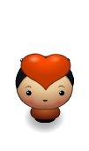
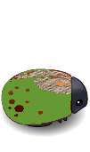

# Frogger Game: Love Despite the Bugs!

This is my love-based version of the Frogger arcade game. The game can be played using this [link](https://cdn.rawgit.com/Awnallah/frontend-nanodegree-arcade-game/master/index.html). 

- The main player in this game is Max who can be controlled using the arrow keys. This is Max:

  

- Max loves the **Princess**:
 , but he needs to give her a **heart** :  everytime he needs to increase the **love score**.

To increase the love score, Max needs to carry  a heart and bring it to the Princess. Once Max has the heart, you will see it on top of him : .

- Max is a smart guy. He doesn't fear approaching the water since he knows that water is covered by a clear floor .

- Max must avoid touching the **two types of bugs** as they will make him lose the love score and start all over. These are the two bugs he must avoid: 

- There is no limit to the level of love, you can score as high as you want, but with each level, the number of bugs and their speed will slightly increase.
